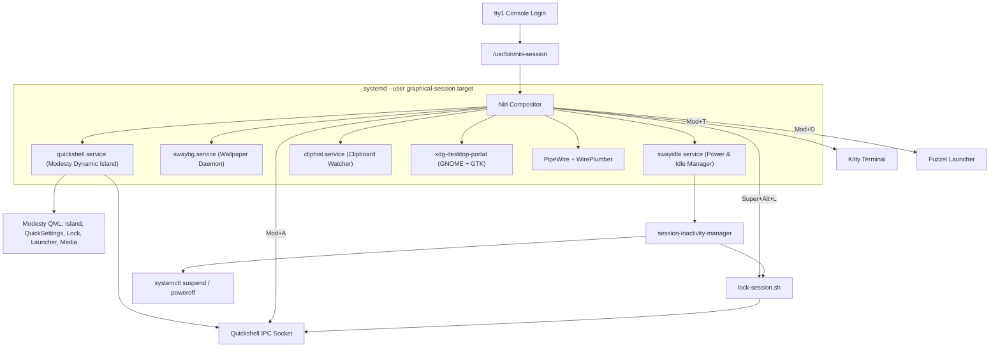

# Desktop Component Dependency Map

```mermaid
flowchart TD
    Login["tty1 Console Login"] --> NiriSession["/usr/bin/niri-session"]
    NiriSession --> Niri["Niri Compositor"]
    
    subgraph SystemdUser ["systemd --user graphical-session.target"]
        Niri --> QuickShell["quickshell.service (Modesty Dynamic Island)"]
        Niri --> Swaybg["swaybg.service (Wallpaper Daemon)"]
        Niri --> Swayidle["swayidle.service (Power & Idle Manager)"]
        Niri --> Cliphist["cliphist.service (Clipboard Watcher)"]
        Niri --> Portals["xdg-desktop-portal (GNOME + GTK)"]
        Niri --> PipeWire["PipeWire + WirePlumber"]
    end
    
    QuickShell --> QMLModules["Modesty QML: Island, QuickSettings, Lock, Launcher, Media"]
    QuickShell --> IPC["Quickshell IPC Socket"]
    
    Niri -->|Mod+T| Kitty["Kitty Terminal"]
    Niri -->|Mod+D| Fuzzel["Fuzzel Launcher"]
    Niri -->|Mod+A| IPC
    Niri -->|Super+Alt+L| LockScript["lock-session.sh"]
    
    LockScript --> IPC
    Swayidle --> InactivityManager["session-inactivity-manager"]
    InactivityManager --> LockScript
    InactivityManager --> Systemctl["systemctl suspend / poweroff"]
```
